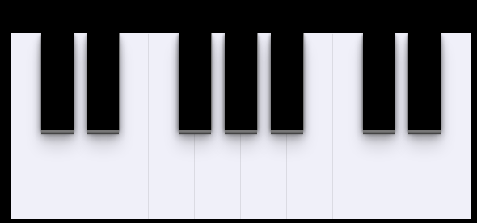

<h1 align="center">
  No projecto de hoje fiz um piano usando HTML, CSS e os recursos que a DOM oferece.
</h1>

Esse projeto foi desenvolvido usando uma masterclass da Rocketseat:

- [Manipulação de DOM com JavaScript, do zero, na prática](https://www.youtube.com/watch?v=UftSB4DaRU4)

  

Feito com ♥ by Apolinário Manuel
